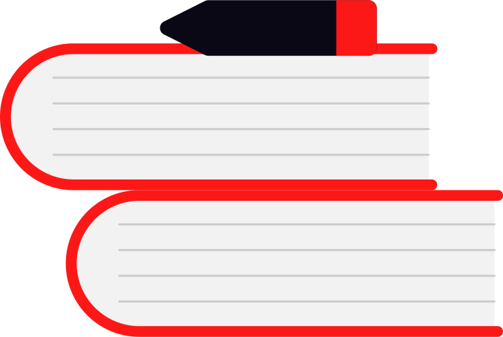

# Stack Data Structure

 

A Stack is a fundamental data structure in computer science that follows the Last In, First Out (LIFO)  principle. It is similar to a stack of plates in a cafeteria; you can only take the top plate off, and to add a new plate, you place it on the top of the stack.

This structure supports two main operations:

 - **Push**: Adds an element onto the top of the stack.
 - **Pop**: Removes the element from the top of the stack.
  
Additionally, stacks typically supports auxiliary operations such as:

 - **Peek or Top**: Returns the top element without removing it.
 - **isEmpty**: Checks if the stack is empty.
 - **Size**: Returns the number of elements in the stack.
 - **isFull**: Checks if the stack has reached its maximum capacity (if applicable).
 - **Clear**: Removes all elements from the stack.

## Working Principle of Stack

The operations for managing a stack work as follows:

### Initialization:

    - A pointer called _TOP_ is used to keep track of the top element in the stack.
    - When initializing the stack, set _TOP_ to -1. This initial value allows us to check if the stack is empty by comparing _TOP_ == -1.

### Push Operation:

    - Before pushing an element, check if the stack is already full. If the stack is not full, increase the value of TOP by 1.
    - Place the new element in the position pointed to by TOP.

### Pop Operation:

    - Before popping an element, check if the stack is already empty. If the stack is not empty, return the element pointed to by TOP.
    - Decrease the value of TOP by 1 to remove the top element from the stack.

