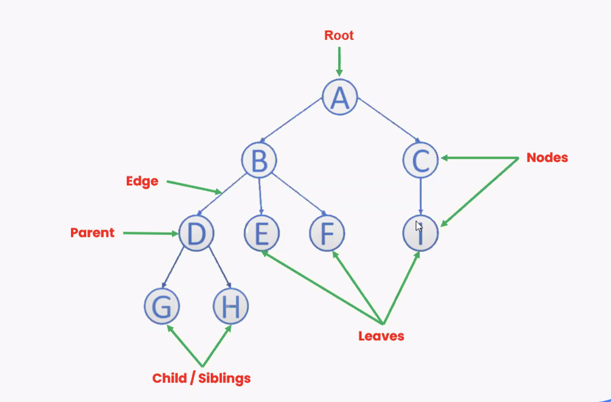

# Tree Data Structure

A tree is a non-linear hierarchical data that consists of nodes connected by edges.

A tree is a  widly abstracted data type (ADT) that simulates a hierarchical tree structure, with a set of linked nodes. It is a non-linear data structure, as opposed to arrays, linked lists, stacks, and queues which are linear data structures.

```plaintext

                       (A)
                       / \
                      /   \
                    (B)   (C)
                    / \ 
                   /   \
                 (D)   (E)

```


## Key Terminologies:

- **Node**: This is the fundamental part of a tree. Each node contains a value or data, and it may have a link to other nodes (children).

- **Root**: The top nodes of a tree. It does not have a parent node.

- **Edge**: The connection between one node to another (two nodes are connected by an edge).

- **Child**: A node directly connected to another node when moving away from the root.

- **Parent**: A node directly connected to another node when moving towards the root.

- **Leaf**: A node that does not have any children.

- **Sibling**: A nodes that belong to the same parent node.

- **Depth**: The depth of a node is the number of edges from the node to the tree's root node.

- **Height**: The height of a node is the number of edges on the longest path from the node to a leaf. The height of the tree is the height of the root node.

- **Subtree**: A tree consisting of a node and its descendants.

</br>



</br>

## Types of Trees:

- **[Binary Tree](./BinaryTree/)**: Each node has at most two children.

- **Binary Search Tree (BST)**: A binary tree where the left child contains values less than the parent node, and the right child contains values greater than the parent node.

- **AVL Tree**: A self-balancing binary search tree where the height of the two child subtrees of any node differs by at most one.

- **Red-Black Tree**: A self-balancing binary search tree with additional properties to ensure the tree remains balanced.

- **B-Tree**: A self-balancing search tree in which nodes can have multiple children, often used in databases and file systems.

- **Trie**: A tree-like data structure used to store a dynamic set of strings, where the keys are usually strings.


## Basic Operations:

 - **Insertion**: Adding a new node to the tree.

 - **Deletion**: Removing a node from the tree.

 - **Traversal**: Visiting all the nodes in a specific order.
     - **In-order Traversal**: Left, Root, Right (for BST, it gives sorted order).
     - **Pre-order Traversal**: Root, Left, Right.
     - **Post-order Traversal**: Left, Right, Root.
