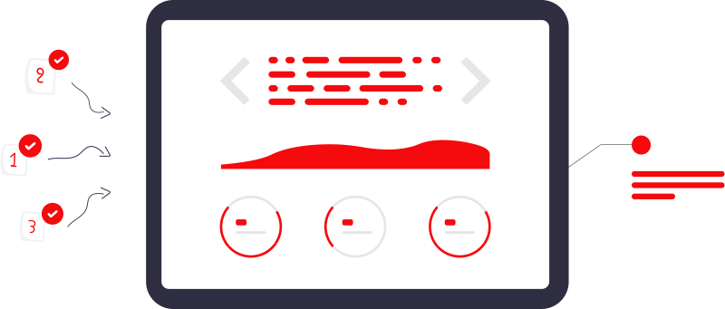

# DSA (Data Structures and Algorithms)

- Empowering developers with Essential Data Skills for Efficient Problem Solving.

## What is Data Structures?

Data structures are fundamental constructs used in software engineering to organize and manage data efficiently. They provide a way to store and manipulate data so that operations like searching, sorting, inserting, and deleting can be performed quickly and effectively.

_Data Structures are used to organize and store data to use it in an effective way when performing data operations._

*Note:*
Depending on your requirement and project, it is important to choose the right data structure for your project.

## What is Algorithm?

Algorithms are step-by-step procedures or sets of rules followed to solve problems or accomplish specific tasks. In software engineering, algorithms are essential for performing computations, data processing, and automated reasoning. They serve as the backbone for computer programs, determining how data is processed, manipulated, and transformed.

Algorithm is a set of well-defined instructions to solve a particular problem. It takes a set of input(s) and produces the desired output.

### Example:
An algorithm to add two numbers:
 1. Take two numbers as input.
 2. Add numbers using the addition operator (+).
 3. Display the result.

### Qualities of a good Algorithm:

Here are some essential qualities that define a good algorithm:

 - Input & Output should be defined precisely.
 - Each step in the algorithm should be clear and unambiguous.
 - Algorithm should be most effective among many different ways to solve a problem.
 - An algorithm shouldn't include computer code. Instead, the algorithm should be written in such a way that it can be used in different programming languages.

### Key Characteristics of Algorithms include:

+--------------+------------------------------------------------------------------+
| Input        | Algorithms take zero or more inputs. These inputs can be numbers,| 
|              | strings, arrays, or any other data type relevant to the problem  |
|              | being solved.                                                    |
+--------------+------------------------------------------------------------------+
| Output       | Algorithms produce one or more outputs based on the input and the|
|              | steps performed. The output could be a result, a modified input, |
|              | or simply a signal indicating completion of a task.              |
+--------------+------------------------------------------------------------------+
| Definiteness | Algorithms are precise and unambiguous, with each step clearly   |
|              | defined and executable. This ensures that the algorithm can be   |
|              | followed exactly and consistently to produce the desired outcome.|
+--------------+------------------------------------------------------------------+
| Finiteness   | Algorithms must terminate after a finite number of steps. They   |
|              | cannot run indefinitely, ensuring that the problem-solving       |
|              | process eventually reaches a conclusion.                         |
+--------------+------------------------------------------------------------------+
| Effectiveness| Algorithms must be effective in solving the problem they are     |
|              | designed for. This means they should correctly solve the problem,|
|              | preferably in an efficient manner, within reasonable time and    |
|              | resource constraints.                                            |
+--------------+------------------------------------------------------------------+

